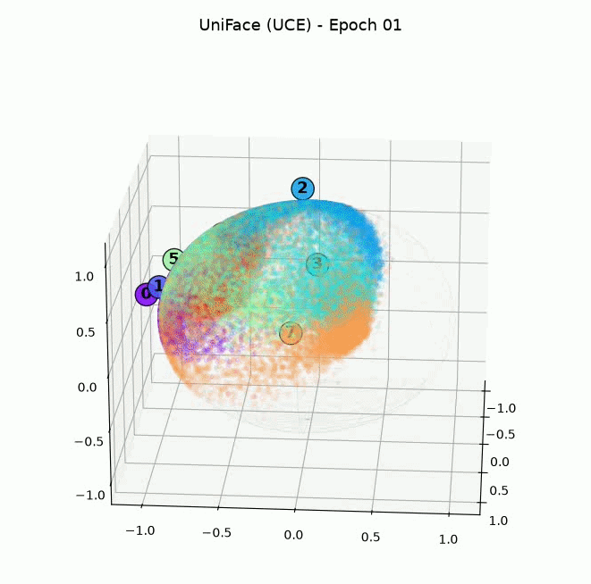
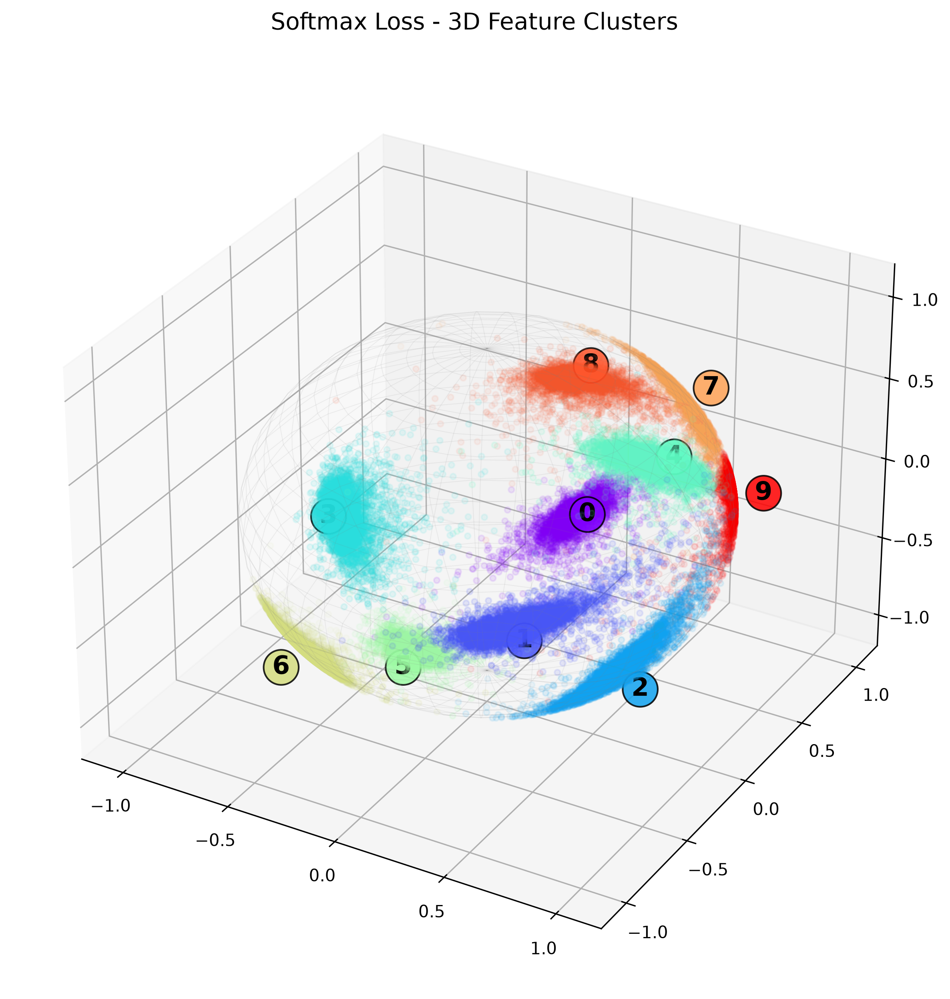
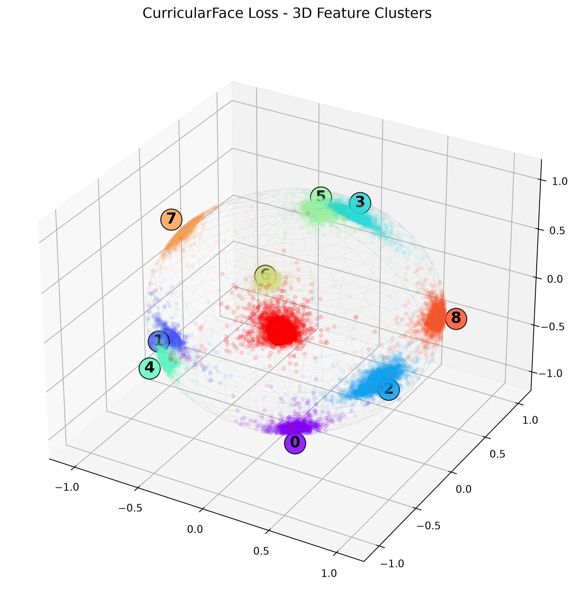
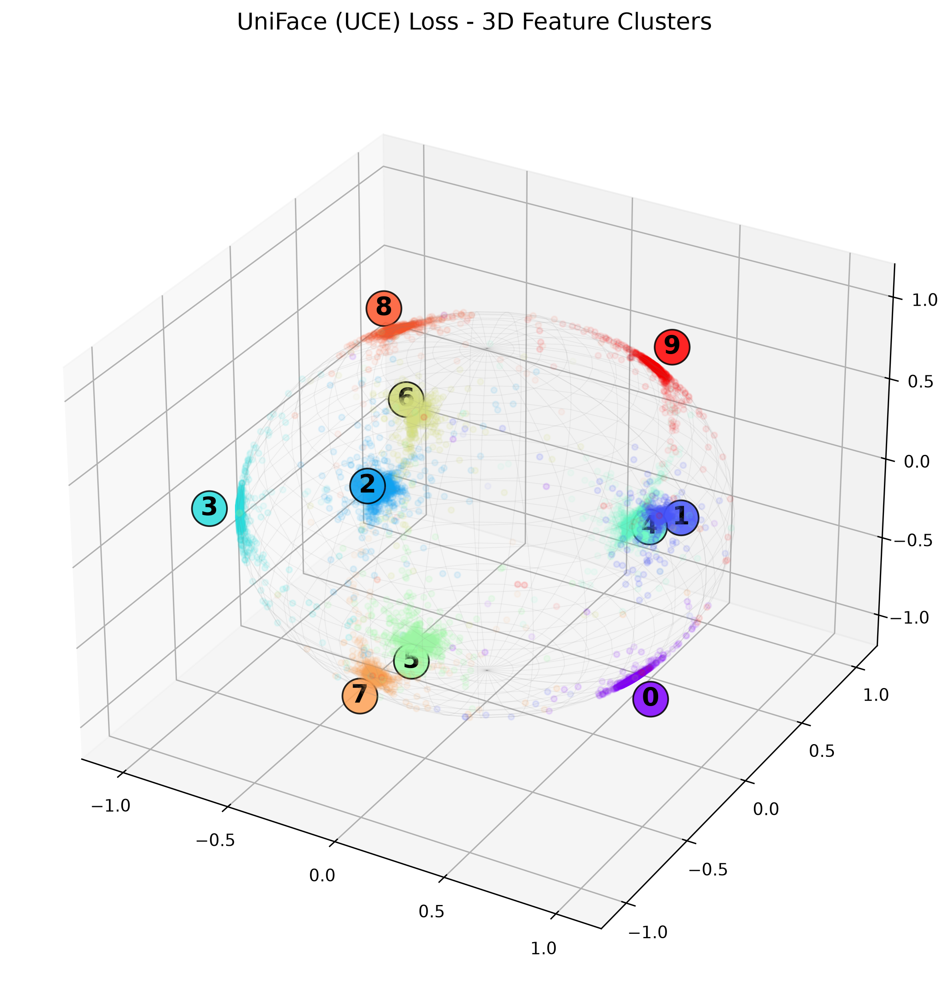

# Visualizing Loss Functions in 3D: Softmax vs. CurricularFace vs. UniFace (UCE)

 

Ever wondered what actually happens to feature embeddings in high-dimensional space as a loss function trains?

To see how modern margin-based losses force tighter intra-class clusters and wider inter-class boundaries on the unit hypersphere, I built a 3D visualization comparing three distinct paradigms trained on MNIST:

1️⃣ Standard Softmax Cross-Entropy:

Acts as a baseline. While it separates classes sufficiently for classification, the embeddings scatter across the hypersphere with wide variance and overlapping class fringes.

2️⃣ CurricularFace Loss:

Integrates Curriculum Learning directly into the angular margin. By dynamically adjusting a threshold parameter ($t$) to emphasize "hard negative samples" as training progresses, it forces the network to refine boundaries and eliminate overlapping class noise.

3️⃣ UniFace / Unified Cross-Entropy (UCE) Loss:

Unifies margin architectures by introducing a learnable threshold ($t = \cos\theta_t$) that dynamically separates intra-class tightness from inter-class discrepancy. Notice how quickly it converges into clean, dense 3D cluster points.

💡 Key Takeaways for Facial Recognition & Biometrics:

Standard Softmax focuses on separability, but metric learning losses focus on compactness and margin expansion.

Adaptive sample weighting (CurricularFace) and unified margin mapping (UniFace) significantly reduce false acceptance rates (FAR) in open-set identification.

Check out the side-by-side progression across 50 epochs in the video. 📽️

 

 

 

## Acknowledgements
This project benefited from ideas, implementations, and inspiration from the following repositories:
- [Unified Cross-Entropy (UCE) Loss](https://github.com/CVI-SZU/UniFace)
- [CurricularFace Loss](https://github.com/HuangYG123/CurricularFace)

